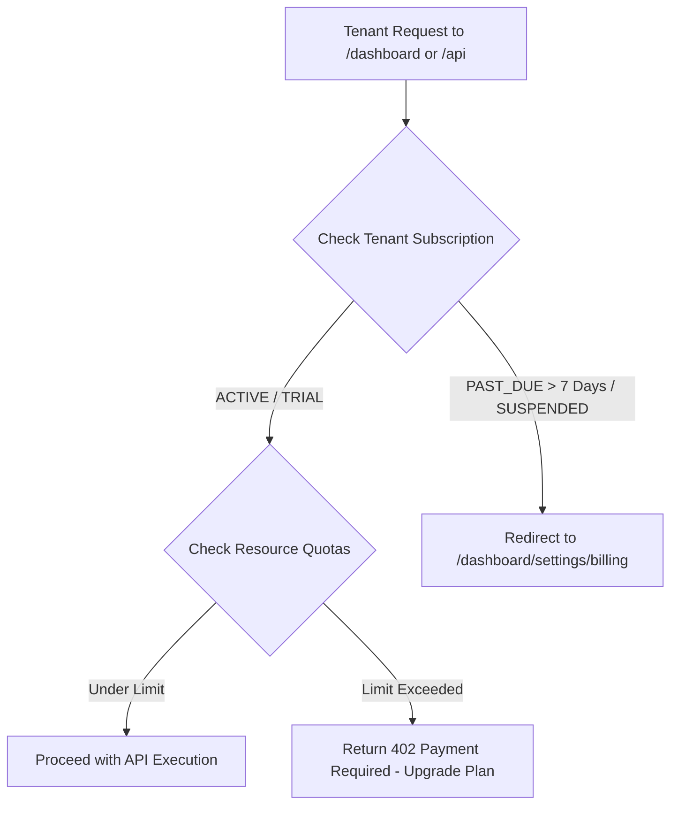

# Multi-Tenant Subscription & Competitive Pricing Architecture

## 1. Executive Summary
Merchant Vault is designed as a high-performance multi-tenant B2B SaaS platform specifically built for Indian D2C brands, textile hubs, and retail chains.

To aggressively compete against and disrupt legacy platforms like Shopify, Merchant Vault offers an **All-in-One ERP + Storefront + POS + WhatsApp CRM** with **0% platform transaction fees**.

---

## 2. Competitive Pricing Strategy vs Shopify

### Why Shopify is Expensive in India
* **Base Subscription**: ~$25 - $39/mo (**~₹1,999 - ₹3,200/mo**).
* **Platform Penalty**: **2.0% extra transaction fee** on all non-Shopify Payments transactions (COD, UPI, Razorpay).
* **Required Third-Party Apps**:
  * WhatsApp Order Recovery & CRM: ~₹2,000/mo
  * Multi-Warehouse Stock Sync: ~₹3,000/mo
  * POS Billing Pro: $89/mo (~₹7,400/mo)
* **Total Monthly Shopify Cost**: **₹7,000 – ₹15,000+ / month**

### Merchant Vault Disruptive Subscription Matrix

| Feature / Limit | STARTER (Micro-Brands) | GROWTH (D2C Scaler) | ENTERPRISE (Hub / Multi-Store) | **Shopify + Apps Equivalent** |
| :--- | :--- | :--- | :--- | :--- |
| **Monthly Price** | **₹999 / mo** | **₹1,999 / mo** | **₹4,999 / mo** | ~₹6,000 - ₹15,000+ / mo |
| **Annual Price (2 Mo Free)** | **₹9,990 / yr** | **₹19,990 / yr** | **₹49,990 / yr** | — |
| **Platform Transaction Fee** | **0%** | **0%** | **0%** | **2.0% + Gateway** |
| **Storefront & POS Module** | Included | Included | Included | Paid App ($89/mo) |
| **WhatsApp CRM & Recall** | Included | Included | Included | Paid App (~₹2,000/mo) |
| **Multi-Location Inventory** | Included | Included | Included | Paid App (~₹3,000/mo) |
| **Max SKU Items** | 1,000 | 10,000 | Unlimited | Unlimited |
| **Max Orders / mo** | 1,000 | 5,000 | Unlimited | Unlimited |
| **Staff Accounts** | 3 | 10 | Unlimited | Limited by Plan |
| **Warehouses** | 1 | 3 | Unlimited | Limited by Plan |

---

## 3. Database Schema Specification (`supabase/schema.sql`)

The database architecture uses three core entities to manage subscriptions, quotas, and invoices:

```sql
-- 1. Subscription Plans Master
CREATE TABLE IF NOT EXISTS "SubscriptionPlan" (
    "id" UUID PRIMARY KEY DEFAULT gen_random_uuid(),
    "code" TEXT UNIQUE NOT NULL, -- 'STARTER', 'GROWTH', 'ENTERPRISE'
    "name" TEXT NOT NULL,
    "monthlyPrice" DOUBLE PRECISION NOT NULL,
    "yearlyPrice" DOUBLE PRECISION NOT NULL,
    "maxProducts" INTEGER DEFAULT 1000,
    "maxMonthlyOrders" INTEGER DEFAULT 1000,
    "maxStaffUsers" INTEGER DEFAULT 5,
    "maxWarehouses" INTEGER DEFAULT 2,
    "hasPosModule" BOOLEAN DEFAULT true,
    "hasShopifySync" BOOLEAN DEFAULT true,
    "hasAdvancedAnalytics" BOOLEAN DEFAULT false,
    "createdAt" TIMESTAMP WITH TIME ZONE DEFAULT timezone('utc'::text, now()) NOT NULL
);

-- 2. Tenant Monthly Meter Tracking
CREATE TABLE IF NOT EXISTS "TenantUsageMeter" (
    "id" UUID PRIMARY KEY DEFAULT gen_random_uuid(),
    "companyId" UUID NOT NULL REFERENCES "Company"("id") ON DELETE CASCADE,
    "billingMonth" TEXT NOT NULL, -- Format: 'YYYY-MM' (e.g. '2026-08')
    "ordersCount" INTEGER DEFAULT 0 NOT NULL,
    "productsCount" INTEGER DEFAULT 0 NOT NULL,
    "whatsappAlertsSent" INTEGER DEFAULT 0 NOT NULL,
    "updatedAt" TIMESTAMP WITH TIME ZONE DEFAULT timezone('utc'::text, now()) NOT NULL,
    UNIQUE("companyId", "billingMonth")
);

-- 3. Billing Ledger & Invoices
CREATE TABLE IF NOT EXISTS "SubscriptionInvoice" (
    "id" UUID PRIMARY KEY DEFAULT gen_random_uuid(),
    "subscriptionId" UUID NOT NULL REFERENCES "Subscription"("id") ON DELETE CASCADE,
    "companyId" UUID NOT NULL REFERENCES "Company"("id") ON DELETE CASCADE,
    "razorpayPaymentId" TEXT,
    "razorpaySignature" TEXT,
    "amount" DOUBLE PRECISION NOT NULL,
    "currency" TEXT DEFAULT 'INR' NOT NULL,
    "status" TEXT NOT NULL, -- 'PAID', 'FAILED', 'PENDING'
    "periodStart" TIMESTAMP WITH TIME ZONE NOT NULL,
    "periodEnd" TIMESTAMP WITH TIME ZONE NOT NULL,
    "createdAt" TIMESTAMP WITH TIME ZONE DEFAULT timezone('utc'::text, now()) NOT NULL
);
```

---

## 4. Middleware & Access Control Flow



---

## 5. Razorpay Subscription & Webhook Lifecycle

1. **Plan Setup**: Razorpay recurring plans (`plan_id`) mapped to `STARTER`, `GROWTH`, and `ENTERPRISE`.
2. **Webhook Listener (`/api/webhooks/razorpay`)**:
   - `subscription.charged`: Extends `nextRenewalDate` by 30 days / 365 days, sets `status = 'ACTIVE'`, logs `SubscriptionInvoice`.
   - `subscription.halted`: Updates status to `PAST_DUE` with a 7-day grace period before lock.
